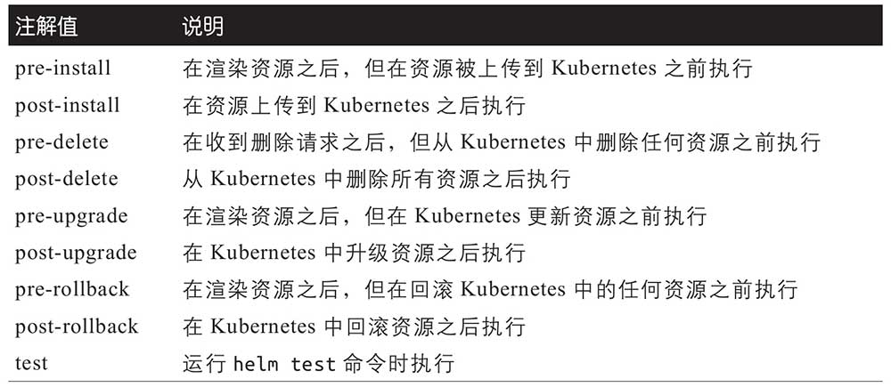
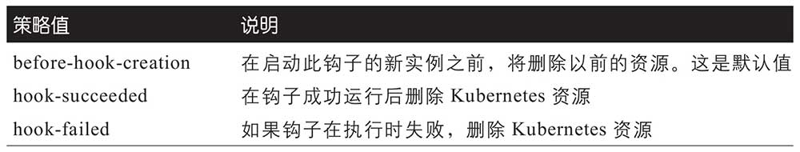
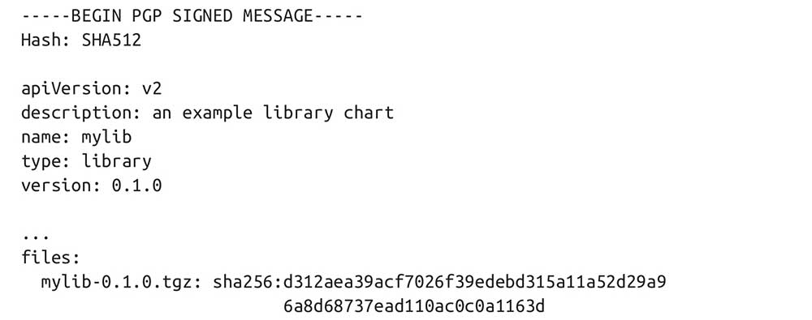
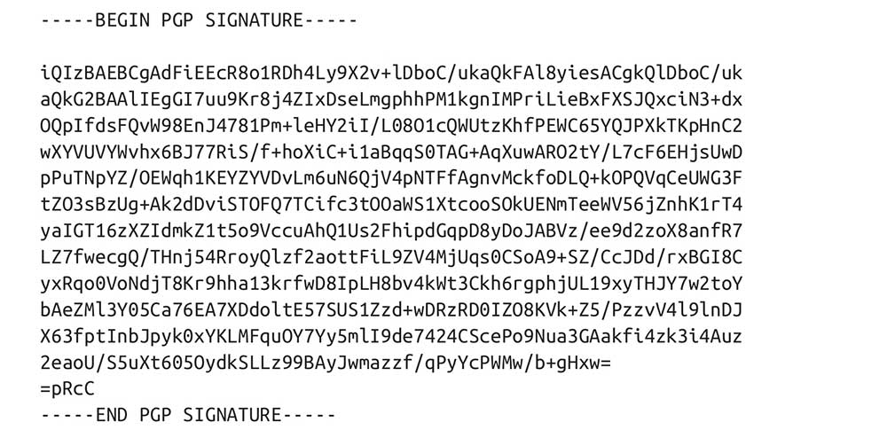

# 基本命令

```shell
helm install mysite bitnami/drupal --set drupalUsername=admin

helm install mysite bitnami/drupal --values values.yaml --set drupalUsername=admin --dry-run

helm template mysite bitnami/drupal --set drupalUsername=admin

helm template --post-renderer mysite bitnami/drupal --set drupalUsername=admin

helm upgrade mysite bitnami/drupal

helm list

helm upgrade mysite bitnami/wordpress --set image.pullPolicy=NoSuchPolicy

helm get notes

helm get manifests

helm get hooks

helm get values

helm get all

helm history name

helm rollback name version-id

helm uninstall name --keep-history

helm install bitnami/wordpress --generate-name

helm install bitnami/wordpress --generate-name  name-template "foo-{{ randAlpha 9 | lower }}"

helm install bitnami/wordpress --generate-name --namespace mynamespace

helm install bitnami/wordpress --generate-name --namespace mynamespace --create-namespace

# 不存在就安装，存在则升级
helm upgrade --installbitnami/wordpress  [[--wait] [--timeout] ] |  [ [ --atomic ] [--timeout] ] [--cleanup-on-fail] [ --force ]
```

**状态变化**

```plaintext
pending-install（挂起-安装）

deployed（已部署）

pending-upgrad（挂起-升级）

superseded（已取代）

pending-rollback（挂起-回滚）

uninstalling（正在卸载）

uninstalled（已卸载

failed（失败）
```

**开发**

```shell
helm create anvil

helm install myapp anvil

helm delete myapp

helm package anvil [--dependency-update(-u)] [--destination(-d)] [--app-version] [--version]

helm lint

helm test
```

helm CLI具有直接传入值的标志（即--set、--set-file和--set-string）或传递带有值（即，-f或--values）的文件的标志。这些值被合并在一起，后传入的值优先采用。

用-来删除前导或尾随空格, 空格已经从带有-的那一方删除，直到下一个非空格字符为止,在（用于删除空格的）-和动作的其余部分之间需要有一个ASCII空格.

管道是一系列链接在一起的命令、函数和变量。变量的值或函数的输出用作管道中下一个函数的输入。管道的最后一个元素的输出就是管道的输出。

缩进是通过使用两个函数来实现的。在toYaml的左边，-与{{一起使用，以删除前一行中到:为止的所有空格。toYaml的输出被传递给nindent。此函数在接收到的文本的开头添加一个新行.

当Helm在开发过程中需要一个模板引擎时，Go标准库中提供的模板引擎是最成熟、最稳定的选择。此外，这个模板引擎有一个安全模型，由Google使用安全策略进行维护。

逻辑、控制结构和数据计算用{{和}}包装。这些被称为动作（action）。动作之外的任何内容都将被复制到输出。

用-来删除前导或尾随空格。

在（用于删除空格的）-和动作的其余部分之间需要有一个ASCII空格。

管道、if/else语句、循环、变量、子模板和函数。

Helm之所以这样工作，是因为template命令只用于处理模板，并且这样做不会意外地从配置的集群泄露信息。

Ken Thompson和Unix团队的另一名成员Rob Pike是Go编程语言原创者中的两位。

.Files中也包含一些方法来帮助你使用文件：
- .Files.Get name
- .Files.GetBytes
- .Files.Glob
- .Files.AsConfig
- .Files.AsSecrets
-  .Files.Lines

lookup模板函数可以返回单个对象或对象列表。当执行与集群不交互的命令时，此函数返回空响应。

lookup函数可传递四个参数：
-  API版本
- 对象的种类
- 从中查找对象的命名空间
- 要查找的资源名称
-  返回列表时，对象位于items属性上

使用if语句是实现通用的enabled模式的典型方式。

当与and或or一起使用的元素之一是函数或管道时，可以使用括号。

with类似于if，注意with块中的作用域发生了更改。

如果传入with的值为空，则跳过该块。如果该值不为空，则执行该块并返回该值。块中的“.”的值是.Values.ingress.annotations，在这种情况下，块中的作用域已更改为用with检查的值。

创建和初始化变量具有特殊的语法：使用:=符号。

range遍历列表中的每一项，当Helm对列表中的每一项进行迭代时，它将“.”的值设置为每项的值。

使用range的另一种方法是让它为键和值创建新的变量。这将适用于list和dict。

**\$key**变量包含map或dict中的键和list中的数字。**\$value**包含值。如果这个值是一个复杂类型（例如另一个dict），那么它将作为$value提供。


**命名模板**

❶　定义函数之前的注释。动作中的注释以/*开始，以*/结束。

❷　你可以使用define语句和模板名称来定义模板。

❸　模板的内容与其他模板的内容一样。

❹　模板的定义通过与define语句匹配的end语句结束。

有两个函数可用于在模板中包含另一个模板：不能用于管道的template函数和可以在管道中使用的include函数。

include函数有两个参数。第一个是要调用的模板的名称，它需要是包含任何命名空间的全名。第二个是要传递的数据对象。

标签以前缀app.kubernetes.io开头，后跟/作为分隔符。Kubernetes的标签文档提到，任何自动生成的标签都应该使用前缀，没有前缀的标签是用户专用的。


# 依赖管理

对于大于0的主版本，当你使用^时，它产生的范围大于或等于你设置的数字，小于下一个主版本。当主版本小于1时，Helm通常将次要版本视为其工作的范围，而不去处理主版本。

~用于指定补丁程序范围。其中，^通常舍入到主版本范围内的最新版本，只要指定了次要版本，~就在次要版本范围内舍入。

一旦指定了依赖项及其请求的版本范围，就需要使用Helm将这些依赖项锁定到特定版本并检索依赖项。如果要将chart打包为第4章中介绍的chart归档文件，则需要在打包之前锁定并获取依赖项。

首先，Helm解析了最新版本的booster chart。它使用存储库中的元数据来知道哪些版本的chart可用。从元数据和指定的版本范围中，Helm找到了最佳匹配。解析的信息将写入Chart.lock文件。在Chart.lock文件中包含的不是版本范围，而是要使用的依赖项的特定版本。这对再现性很重要。Chart.lock文件由Helm管理。下一次运行helm dep up（简写语法）时，来自用户的更改将被覆盖。这类似于其他平台上的依赖项管理器的锁定文件操作。一旦Helm知道要使用的特定版本，它就会下载相关chart并将其放入charts子目录。重要的是依赖chart必须在charts目录中，因为这是Helm从中获取内容以渲染模板的地方。chart可以以归档文件或目录形式存在于chart目录中。当Helm从存储库下载它们时，会将它们存储在它们的归档形式中。

如果你有Chart.lock但是charts目录中没有内容，可以通过运行命令helm dependency build来重建charts目录。这将使用锁文件检索已确定版本的依赖项。

一旦具备了依赖项，Helm将在运行helm install或helm upgrade等命令时渲染它们的资源。

在主chart的values.yaml文件中，可以使用依赖chart的名称创建一个新部分。在此部分中，你可以设置要传入的值。只需设置要更改的chart，因为values.yaml文件中包含的依赖chart将用作默认值。

如果同一chart上有两个依赖项，则可以选择在Chart.yaml文件上使用别名（alias）属性。

如果要控制是否通过依赖项来启用或禁用单个功能，可以对依赖项使用condition属性。

依赖项有一个带有值的condition键，此值告诉Helm在何处查找这些值，以知道是否应该启用或禁用依赖项。

有时你可能需要将值从子chart导入或拉取到父chart中。Helm为此提供了两种方法。一种是子chart显式导出由父chart导入的值的情况，另一种是子chart不导出值的情况。

exports属性是values.yaml文件中的特殊顶级属性。当子chart声明了export属性时，其内容可以直接导入父chart。

当父chart想要从子chart导入值，但子chart尚未导出值时，有一种方法可以告诉Helm将子值拉取到父chart中。

。当在父类中声明依赖项时，它可以使用child和parent文件导入值

在这两种导入方法中，依赖项上使用的都是import-values属性。Helm知道如何区分不同的格式，你可以将两者混合使用。

```yaml
apiVersion: v2
name: rocket
description: Go fast!
version: 1.0.0
appVersion: 9.17.49
icon: https://wile.example.com/rocket.svg
keywords:
  - road runner
  - rocket
home: https://wile.example.com/
sources:
  - https://github.com/masterminds/learning-helm/blob/master/chapter7/rocket
maintainers:
  - name: ACME Corp
    email: maintainers@example.com
  - name: Wile E. Coyote
    email: wile@example.com
dependencies:
  - name: booster
    version: ^1.0.0
    repository: https://raw.githubusercontent.com/Masterminds/learning-helm/master/chapter7/repository/
```

templates目录中以下划线（即_）开头的文件不应渲染要发送给Kubernetes的清单。按照惯例，辅助模板和代码段位于_*.tpl和_*.yaml文件中。


# hook



# 签名




Helm使用了Pretty Good Privacy（PGP）、散列和一个与chart归档文件并列存放的provenance文件。

verify命令将告诉Helm检查散列值和签名。--keyring标志告诉Helm PGP密钥环存在于何处，其公钥与签名chart的私钥相匹配。

从GNU Privacy Guard（GPG）2.1开始，密钥以新的keybox格式存储。此新格式与PGP规范和格式不兼容。

pgp_key.asc是ASCII封装密钥文件的名称，而public.key是相同密钥的二进制格式名称。

```shell
helm package --sign --key 'lvsoso@lvsoso.163.com' --keyring path/to/keyring mychart

helm verify --keyring path/to/keyring mychart-0.1.0.tgz

helm verify mychart-0.1.0.tgz --keyring public.key

helm install --verify  --keyring public.key myrepo/mychart

# GPG secrect to PGP
gpg --export-secret-keys > secring.gpg

# GPG public key to PGP
gpg --export > pubring.gpg

# ASCII format to binary format
gpg --dearmor pgp_key.asc > public.key
```

# repo 管理

```shell
mkdir -p charts-repo/

helm repo index charts-repo/

helm package buildachart/ --destination charts-repo/

helm repo index workspace/ --merge workspace/index-old.yaml

cd charts-repo/ && python -m http.server --bind 127.0.0.1 8181

curl -s0 http://localhost:8181/index.yaml

helm repo add mycharts http://localhost:8181 --username user --password pass

helm repo list

helm repo update

helm repo remove mycharts

helm pull mycharts/buildachart

export HELM_EXPERIMENTAL_OCI=1
docker run -d --name oci-registry -p 5000:5000 registry

helm registry login -u user localhost:5000

helm registry logout localhost:5000

# save to be blob
helm chart save buildachart/   localhost:5000/myrepo/buildachart:0.2.0
# push to registry
helm chart push buildachart/   localhost:5000/myrepo/buildachart:0.2.0

helm chart list

helm chart export localhost:5000/myrepo/buildachart:0.2.0

helm chart remove localhost:5000/myrepo/buildachart:0.2.0
```
